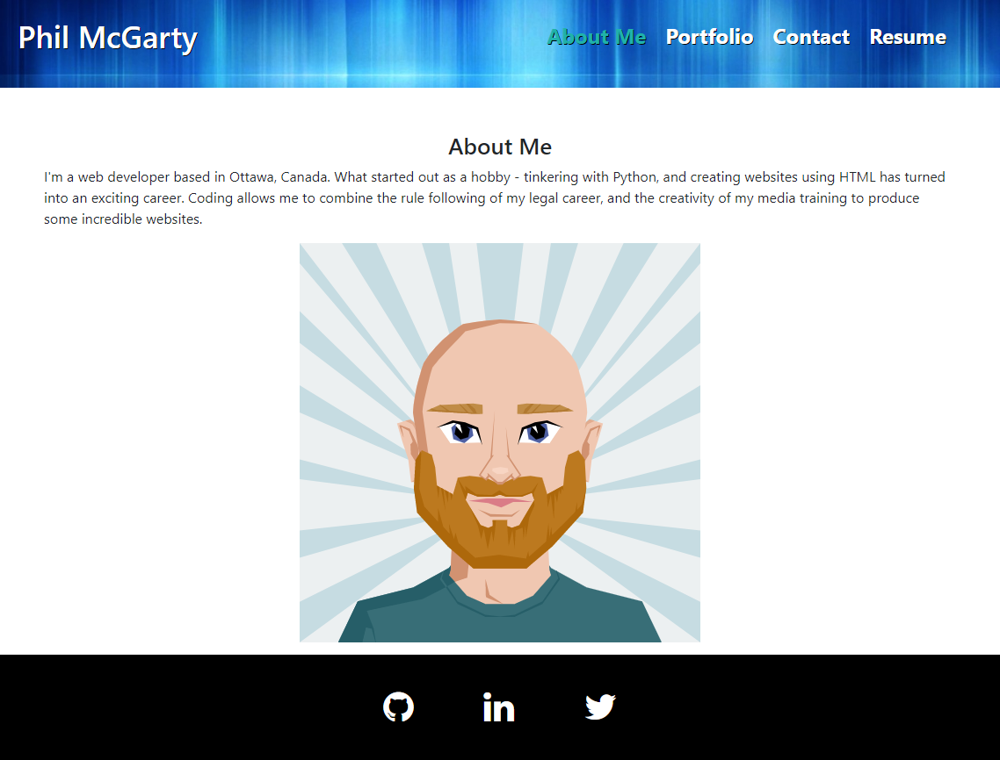
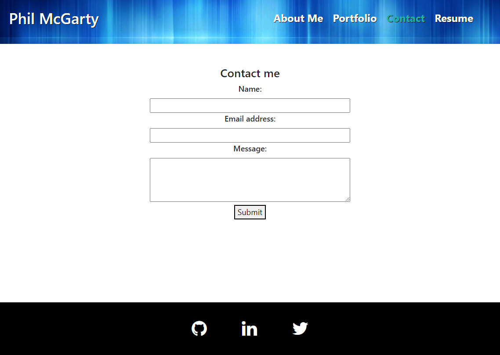
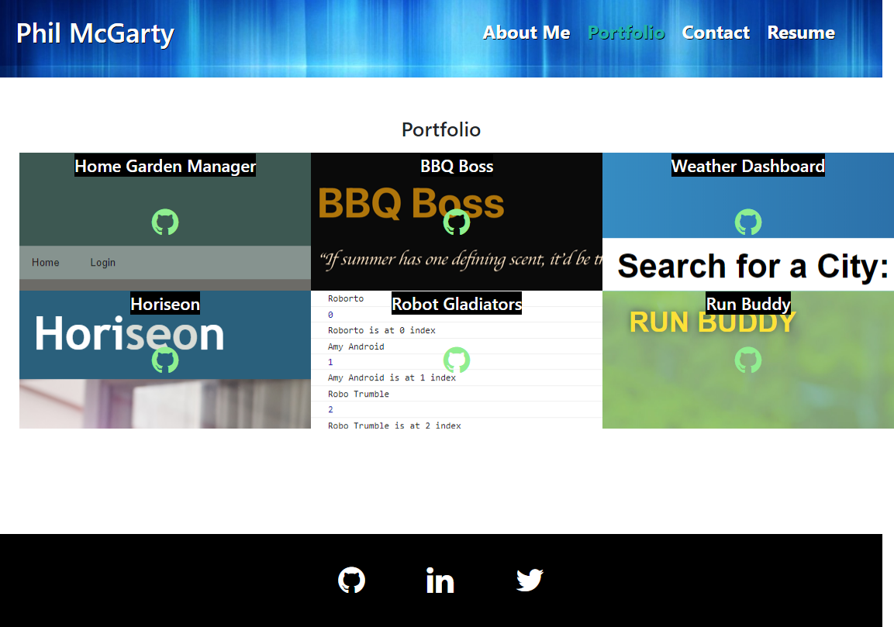
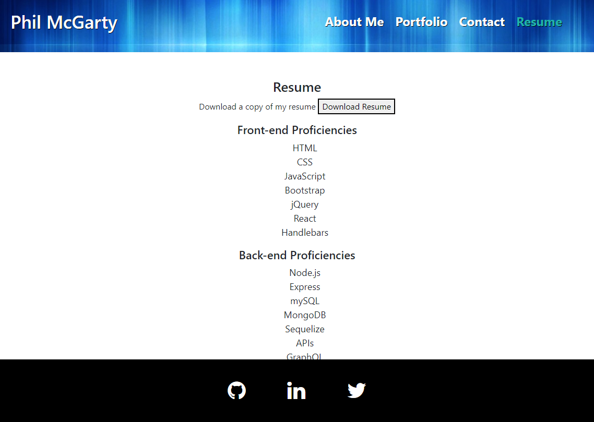

# React Portfolio
Week 20 Challenge

## Description

This is a one page website portfolio to showcase my work to potential employers. The basis of the content came from the previous portfolio (Week 2 challenge).

This website was built from scratch, using React.js, HTML, CSS, Bootstrap, and JavaScript.

## Table of Contents
* [Installation](#installation)
* [Usage](#usage)
* [Tests](#tests)
* [Links](#links)

---
## Installation

**To install packages if running locally**

Type the following at the root directory in a bash prompt to install dependencies: 
*"npm i"*

**To start the server if running locally**

Type *"npm start"* to start the React server. The page should then open, or navigate to: http://localhost:3000/

---
## Usage

The user is presented with a portfolio single page application (SPA). There are 4 pages that render in the main section of the site - About Me, Portfolio, Contact, Resume. When the user clicks a link on the navbar, the page will open and the link is highlighted to indicate that page is active. The portfolio page contains 6 tiles relating to projects - each title has a link to the deployed app and the GitHub repo.

There is a contact form, but it is not yet connected to the backend, so the information is not transmitted. This is the same for the download resume button - it just prints a message to the console.

Future Development: There is a lot of room for improvement with the CSS, and as noted above a backend could be connected to add extra functionality.

---
## Tests

About Me Page

Contact Page

Portfolio Page

Resume Page

---
## Links

[GitHub Repo](https://github.com/philmcgarty/react-portfolio)

[Deployed Portfolio](https://philmcgarty.github.io/react-portfolio/)
